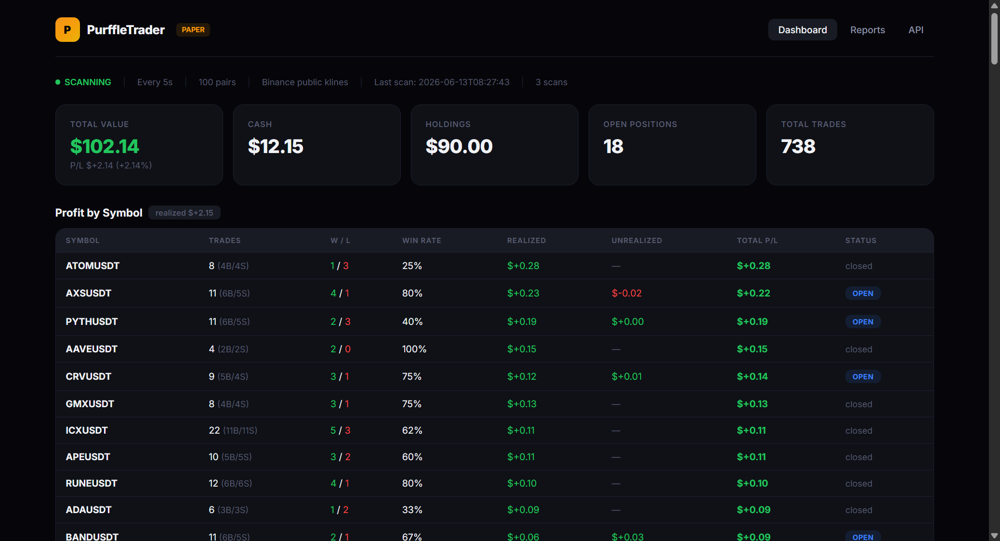
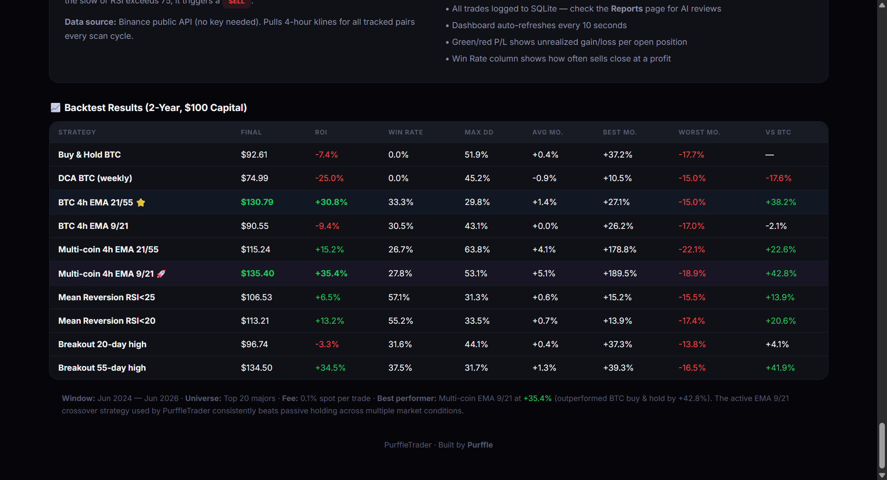

<div align="center">

# PurffleTrader — Crypto Paper Trading Bot

**Scan 100 crypto pairs on Binance every 5 seconds. EMA crossover + RSI strategy. Paper trading with a real-time Flask dashboard.**

[](https://python.org)
[](https://binance.com)
[](https://flask.palletsprojects.com)
[](LICENSE)

[Screenshots](#-screenshots) · [Features](#-features) · [Backtest Results](#-backtest-results) · [Quick Start](#-quick-start) · [Strategy](#-strategy)

</div>

---

## 📸 Screenshots

<div align="center">



*Real-time trading dashboard showing portfolio value, open positions, P&L tracking, and trade history*

</div>

<details>
<summary><b>📊 View Backtest Results & Strategy Guide</b></summary>



*2-year backtest comparison across 10 strategies with detailed metrics*

</details>

---

## 📈 What is PurffleTrader?

PurffleTrader is a **cryptocurrency paper-trading bot** that monitors 100 crypto pairs on Binance 24/7 using technical analysis. No API key required — it reads public candlestick data and simulates trades with virtual money.

Built for **crypto traders**, **quant enthusiasts**, and **developers** who want to test trading strategies in real market conditions without risking capital.

---

## 📊 Strategy

### EMA 9/21 Crossover + RSI Filter

| Signal | Condition |
|--------|-----------|
| **Buy** | EMA-9 crosses above EMA-21 AND RSI < 30 (oversold) |
| **Take Profit** | Position up +3% |
| **Stop Loss** | Position down -2% |

- **Data source:** Binance public klines API (no key needed)
- **Timeframe:** 1-minute candles for signal detection
- **Universe:** 100 pairs — majors, altcoins, DeFi, meme coins, L2 tokens

---

## ✨ Features

| Feature | Description |
|---------|-------------|
| **No API key needed** | Uses Binance public endpoints only |
| **100-pair coverage** | BTC, ETH, SOL, DOGE, PEPE, ARB, and 94 more |
| **Real-time dashboard** | Flask UI with auto-refresh, live P&L, trade history |
| **SQLite logging** | Every trade and portfolio snapshot persisted to disk |
| **Win rate tracking** | Per-symbol W/L statistics and realized P&L |
| **Reports page** | Renders markdown review files from `/reports` directory |
| **Take-profit & stop-loss** | Automatic position management at +3% / -2% |
| **AI-ready** | Designed for daily/weekly AI review routines |

---

## 📊 Backtest Results

**2-Year backtest** across Top 20 majors | Jun 2024 — Jun 2026 | $100 starting capital | 0.1% spot fee

| Strategy | Final | ROI | Win Rate | Max DD | vs BTC |
|----------|:-----:|:---:|:--------:|:------:|:------:|
| Buy & Hold BTC | $92.61 | -7.4% | — | 51.9% | — |
| DCA BTC (weekly) | $74.99 | -25.0% | — | 45.2% | -17.6% |
| **BTC 4h EMA 21/55** ⭐ | **$130.79** | **+30.8%** | 33.3% | 29.8% | **+38.2%** |
| BTC 4h EMA 9/21 | $90.55 | -9.4% | 30.5% | 43.1% | -2.1% |
| Multi-coin EMA 21/55 | $115.24 | +15.2% | 26.7% | 63.8% | +22.6% |
| **Multi-coin EMA 9/21** 🚀 | **$135.40** | **+35.4%** | 27.8% | 53.1% | **+42.8%** |
| Mean Reversion RSI<25 | $106.53 | +6.5% | 57.1% | 31.3% | +13.9% |
| Mean Reversion RSI<20 | $113.21 | +13.2% | 55.2% | 33.5% | +20.6% |
| Breakout 20-day | $96.74 | -3.3% | 31.6% | 44.1% | +4.1% |
| **Breakout 55-day** | **$134.50** | **+34.5%** | 37.5% | 31.7% | **+41.9%** |

> **Best performer:** Multi-coin EMA 9/21 at **+35.4% ROI**, beating BTC buy & hold by **+42.8%**

---

## 🚀 Quick Start

### Prerequisites

- Python 3.9+
- Internet connection (Binance public API)

### Install & Run

```bash
# Clone
git clone https://github.com/Chamanrajragu/purffle-trader.git
cd purffle-trader

# Setup
python -m venv venv
source venv/bin/activate  # Windows: venv\Scripts\activate
pip install -r requirements.txt

# Run
python crypto_bot.py
```

Open **http://localhost:12345** to view the dashboard.

---

## ⚙️ Configuration

All strategy parameters are defined at the top of `crypto_bot.py`:

```python
EMA_FAST = 9              # Fast EMA period
EMA_SLOW = 21             # Slow EMA period
RSI_PERIOD = 14           # RSI lookback
RSI_OVERSOLD = 30         # Buy threshold
POSITION_SIZE_PCT = 0.10  # 10% of cash per trade
TAKE_PROFIT_PCT = 0.03    # +3% take profit
STOP_LOSS_PCT = 0.02      # -2% stop loss
```

---

## 📁 Project Structure

```
purffle-trader/
├── crypto_bot.py          # Main bot + Flask dashboard
├── _reset_db.py           # Database reset utility
├── requirements.txt       # Python dependencies
├── screenshots/           # README screenshots
└── reports/               # AI-generated trade reviews
```

---

## ⚠️ Disclaimer

> **Paper trading only.** This bot does not execute real trades or require any exchange API keys. Past simulated performance does not guarantee future results. This is for educational purposes — always do your own research before trading cryptocurrency.

---

<div align="center">

**Built by [Chaman Raj](https://github.com/Chamanrajragu)**

Part of the **Purffle** ecosystem — PurffleTools · PurffleAI · [Purffle.com](https://purffle.com)

</div>
